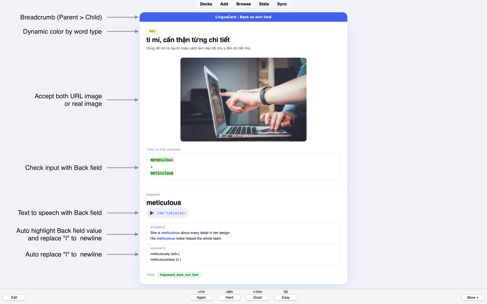
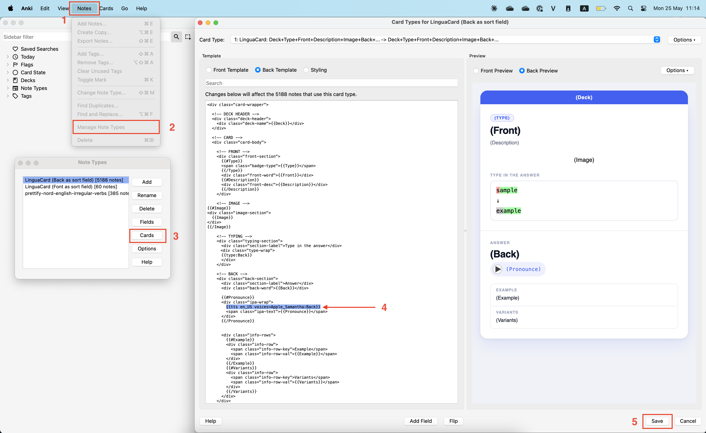

# LinguaCard — Clean Vocabulary Template for Anki

A minimal, modern Anki note type for learning vocabulary.


> Designed to be clean, readable, and distraction-free — so you can focus on what matters: actually learning.

---

## Features



- Dynamic type badge — color-coded by word type (noun, verb, adj, adv, ...)
- Text-to-speech — auto-reads the answer aloud with a native voice
- Image support — URL or embedded image
- Type-in answer — test yourself before revealing the answer
- Auto-highlight — the answer word is highlighted wherever it appears in the example sentence
- Multi-value fields — use `|` to separate multiple examples or variants; they display as individual lines automatically

---

## Fields

| Field | Description                                                                                          |
|---|------------------------------------------------------------------------------------------------------|
| `Type` | Word type: `noun`, `n`, `n.`, `verb`, `adj`, `adv`, ... Displayed as a color-coded badge on the card |
| `Front` | The front of the card — the word or phrase to learn                                                  |
| `Description` | A hint or secondary meaning, shown below the front word                                              |
| `Image` | An image URL or directly embedded image                                                              |
| `Back` | The main answer                                                                                      |
| `Pronounce` | IPA transcription; also triggers text-to-speech to read `Back` aloud                                 |
| `Example` | An example sentence — `Back` is highlighted automatically. Use `\|` for multiple lines               |
| `Variants` | Word variants or related forms. Use `\|` for multiple lines                                          |
| `Tags` | Built-in Anki tags                                                                                   |

---

## Import

1. Download the [LinguaCard.apkg](apkg/LinguaCard.apkg) file
2. Open **Anki** and go to **File** > **Import**
3. Select the downloaded file and click **Import**

The note type and styling are imported automatically — no additional setup required.

---

## Configuration

### Change the Text-to-Speech voice

The template uses `Apple Samantha` (US English) by default. To switch to a different voice:

**Anki** > **Notes** > **Manage Note Types** > Select **LinguaCard** > **Cards** > **Back Template**

Find the following line:

```
{{tts en_US voices=Apple_Samantha:Back}}
```

Replace `Apple_Samantha` with your preferred voice (e.g. `Microsoft_Zira` or `Google_UK_English_Female`) and click **Save**.



### Disable Type-in Answer on mobile

If you use AnkiDroid or AnkiMobile and prefer not to type answers:

**Anki** > **Settings** (gear icon) > **Review** > Enable **Never Type Answer**

---

## Contributing

If you find this template useful, consider starring the repo and sharing it with others learning a new language.
Bug reports, suggestions, and pull requests are always welcome.